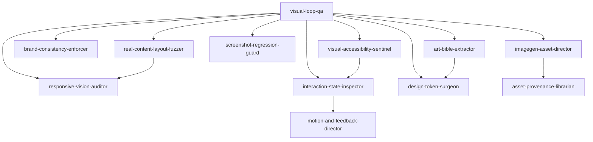

# codex-visual-builder-guild


Welcome to the **Codex Visual Builder Guild**: a free, open-source guild of H70-C+ Spark Skill Graphs that helps Codex build better-looking apps with imagegen, screenshots, vision review, and specialist delegation.

Think of it like hiring a tiny fantasy design studio for your Codex Desktop session. One specialist checks spacing. One makes assets. One stress-tests mobile. One guards accessibility. One turns the winning design into reusable rules. Together, they help Codex stop guessing and start looking.

Free community drop. MIT licensed. Fork it, remix it, install it into Spark Skill Graphs, or use the YAML skills directly in your own agent runtime.

## Install For Codex

If you just want to use the guild inside Codex Desktop, install the native Codex wrapper skill:

```powershell
git clone https://github.com/vibeforge1111/codex-visual-builder-guild.git
cd codex-visual-builder-guild
npm install
npm run install:codex
```

Then restart Codex Desktop or start a new Codex session and say:

```text
Use codex-visual-builder-guild to run the visual builder loop on this app.
```

That gives Codex one easy skill to invoke. The wrapper skill knows the full 16-specialist guild and can route work through the right specialist lens.

## The 10-Second Pitch


Most AI-made UIs fail because the agent writes code once and never really sees the result.

This guild gives Codex a loop:

```text
build -> run -> screenshot -> vision review -> delegate -> fix -> compare -> keep the rules
```

That means Codex can:

- generate UI-ready image assets instead of waiting on placeholders
- inspect real screenshots instead of guessing from code
- catch mobile, spacing, contrast, and interaction problems
- hand narrow problems to specialist skills
- turn great screens into design rules, tokens, and regression baselines
- work standalone or inside Spark Skill Graphs

## Start With This Prompt

Paste this into Codex Desktop when you want the full guild experience. If you installed the Codex skill, start with `Use codex-visual-builder-guild`.

```text
Use codex-visual-builder-guild as a visual product team.

Goal: [describe what we are building].

Run the app locally, take screenshots on desktop and mobile, inspect the rendered UI with vision, and delegate issues to the right specialists. Use imagegen when custom assets would improve the product. Focus on hierarchy, spacing, contrast, text fit, responsive layout, interaction states, accessibility, and visual consistency.

Do not stop at the first draft. Iterate until the UI feels polished, compare before/after screenshots, and summarize the final design rules.
```

More copy-paste prompts live in [PROMPTS.md](PROMPTS.md).

## How It Works


The guild is not a design theory packet. It is a working loop:

1. Codex builds or changes the app.
2. Codex runs it locally.
3. Codex captures screenshots.
4. Vision inspects what actually rendered.
5. The guild routes problems to specialists.
6. Codex fixes the product and screenshots it again.
7. Winning choices become reusable rules.

Imagegen creates source material. Vision judges the real interface. Spark Skill Graphs make the specialist routing visible and reusable.

## Summon The Right Specialist

Use the full guild prompt when you want the whole team. Use a specialist lens when you already know the problem.

| If you want... | Summon... | Prompt starter |
| --- | --- | --- |
| a full visual QA loop | `visual-loop-qa` | "Use codex-visual-builder-guild with the visual-loop-qa lens. Run the app, screenshot desktop and mobile, inspect with vision, delegate issues, fix, and compare before/after." |
| custom UI art or product visuals | `imagegen-asset-director` | "Use codex-visual-builder-guild with the imagegen-asset-director lens. Generate UI-ready assets that match this product, then integrate and screenshot them in context." |
| mobile/tablet/desktop confidence | `responsive-vision-auditor` | "Use codex-visual-builder-guild with the responsive-vision-auditor lens. Check the layout across mobile, tablet, desktop, and wide screens." |
| hover, focus, modal, loading, and error polish | `interaction-state-inspector` | "Use codex-visual-builder-guild with the interaction-state-inspector lens. Click through the main flows and inspect every important interaction state." |
| consistent product taste | `brand-consistency-enforcer` | "Use codex-visual-builder-guild with the brand-consistency-enforcer lens. Compare screens and enforce one coherent visual language." |
| a reusable style guide | `art-bible-extractor` | "Use codex-visual-builder-guild with the art-bible-extractor lens. Turn the best screenshots into an art bible." |
| durable design tokens | `design-token-surgeon` | "Use codex-visual-builder-guild with the design-token-surgeon lens. Extract repeated visual decisions into tokens and component contracts." |
| before/after safety | `screenshot-regression-guard` | "Use codex-visual-builder-guild with the screenshot-regression-guard lens. Capture baselines and compare screenshots after changes." |
| ugly real data testing | `real-content-layout-fuzzer` | "Use codex-visual-builder-guild with the real-content-layout-fuzzer lens. Stress the UI with ugly realistic content." |
| accessibility confidence | `visual-accessibility-sentinel` | "Use codex-visual-builder-guild with the visual-accessibility-sentinel lens. Check contrast, focus, tap targets, color-only meaning, and motion sensitivity." |
| visual variants | `ab-visual-lab` | "Use codex-visual-builder-guild with the ab-visual-lab lens. Create three visual variants, screenshot them, compare them, and choose the winner." |
| stronger hero sections | `hero-image-cinematographer` | "Use codex-visual-builder-guild with the hero-image-cinematographer lens. Make the first viewport communicate the product immediately." |
| calmer SaaS/admin screens | `saas-dashboard-operator` | "Use codex-visual-builder-guild with the saas-dashboard-operator lens. Make this dashboard dense, readable, scannable, and easy to operate repeatedly." |
| game UI polish | `game-ui-polish` | "Use codex-visual-builder-guild with the game-ui-polish lens. Review the HUD, inventory, stats, controls, and mobile layout like a player." |
| motion and feedback | `motion-and-feedback-director` | "Use codex-visual-builder-guild with the motion-and-feedback-director lens. Polish hover, loading, transitions, progress, and feedback." |
| asset traceability | `asset-provenance-librarian` | "Use codex-visual-builder-guild with the asset-provenance-librarian lens. Track generated assets, prompts, usage intent, and replacement notes." |

## Delegation Map


`visual-loop-qa` is the guild captain. It does not try to solve every problem alone. It looks at the screenshot, names the failure class, and sends the right job to the right specialist.



Every handoff uses H70-C+ `delegates_version: 2` contracts:

- `pass_context`: what the specialist receives
- `expect_back`: what the specialist must return
- `sla`: whether the handoff is synchronous or async

## Specialist Wing


The delegation map shows the core routing. The specialist wing rounds out the full 16-skill roster with the skills that tend to activate after a visual issue becomes more specific.

The point is simple: one big vague prompt like "make it look better" becomes a team of smaller, sharper jobs.

## Three Ways To Use It


**Codex Desktop**: install `codex/codex-visual-builder-guild` as a native Codex skill with `npm run install:codex`, then invoke it by name. This is the easiest path for most people.

**Standalone YAML**: load any file in `design/*.yaml` directly into an agent, prompt system, CLI tool, or custom runtime. Each H70-C+ skill is self-contained. This is the lightest path for agent builders.

**Spark Skill Graphs**: copy the same files into a Spark Skill Graphs checkout. `design/*.yaml` become graph nodes, `delegates` become graph edges, and `bundles/codex-visual-builder-loop.yaml` becomes the recommended guild load order. This is the full graph/dashboard path.

## Install Into Spark Skill Graphs

From this repo root:

```powershell
Copy-Item -Recurse -Force .\design\*.yaml C:\Users\USER\Desktop\spark-skill-graphs\design\
Copy-Item -Force .\bundles\codex-visual-builder-loop.yaml C:\Users\USER\Desktop\spark-skill-graphs\bundles\
```

Then validate from `spark-skill-graphs`:

```powershell
$env:NODE_PATH='C:\Users\USER\Desktop\spawner-ui\node_modules'
$env:SPAWNER_H70_SKILLS_DIR='C:\Users\USER\Desktop\spark-skill-graphs\design'
node C:\Users\USER\Desktop\spark-skill-graphs\tools\validate-h70-cplus.js
```

If you use the Spark MCP server or dashboard, restart/re-index it after copying the files. Already-running MCP/dashboard processes may keep an older in-memory skill index and return `Skill not found` until restarted.

## Tested Before Ship


This package includes local checks for the parts that matter most:

- H70-C+ structure
- required 12-section coverage
- embedded disaster detection commands
- embedded anti-pattern detection
- delegate contract completeness
- bundle load order resolution
- common Codex visual-loop invocation cues
- Codex wrapper install and invocation coverage

Validate this package:

```powershell
npm install
npm test
```

Expected result:

```text
Valid H70-C+: 16
Invalid: 0
With warnings: 0
Smoke test passed
Usage audit passed
```

## What Is Inside

- `design/*.yaml`: 16 H70-C+ design skills
- `codex/codex-visual-builder-guild/SKILL.md`: native Codex wrapper skill
- `bundles/codex-visual-builder-loop.yaml`: recommended guild load order
- `tools/validate-h70-cplus.js`: H70-C+ structure validator
- `tools/smoke-test.cjs`: practical package smoke test
- `tools/usage-audit.cjs`: Codex install and invocation coverage audit
- `tools/install-codex-skill.cjs`: one-command Codex skill installer
- `PROMPTS.md`: copy-paste prompts for the whole guild and each specialist
- `assets/*.png`: README and X-ready visual explainers

## Infographic Set

- `assets/hero-guild-banner.png`: X and README hero
- `assets/what-you-get.png`: install value
- `assets/how-it-works.png`: visual builder loop
- `assets/delegation-map.png`: specialist routing
- `assets/specialist-wing.png`: remaining specialist roster
- `assets/use-it-two-ways.png`: Codex, standalone YAML, and Spark dashboard usage
- `assets/tested-before-ship.png`: validation and trust
