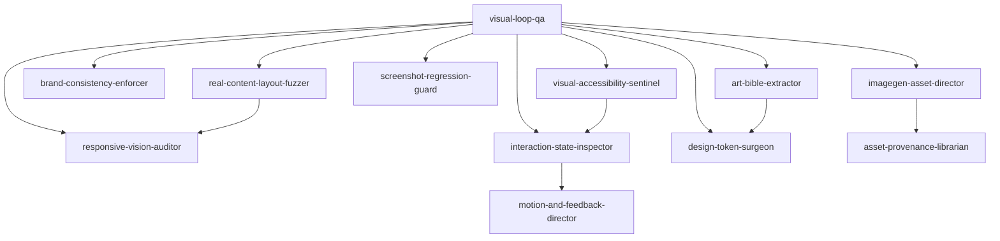

# spark-codex-design-team

H70-C+ Spark Skill Graphs for Codex Desktop visual product building.

Free community drop. MIT licensed. Fork it, remix it, copy the skills into your own Spark graph, or use the YAML directly in your own agent runtime.

This pack turns the imagegen plus vision workflow into a disciplined specialist team:

```text
prompt -> build -> run -> screenshot -> vision review -> specialist delegation -> revise -> compare -> extract rules
```

Imagegen creates source material. Vision judges the rendered product. The skills in this repo keep that loop grounded in screenshots, responsive states, interaction states, accessibility, brand consistency, design tokens, and regression safety.

## What's Included

- `design/*.yaml`: 16 H70-C+ design skills
- `bundles/codex-visual-builder-loop.yaml`: recommended load order for the team
- `tools/validate-h70-cplus.js`: H70-C+ structure validator

## Core Team

- `visual-loop-qa`: router and visual QA orchestrator
- `imagegen-asset-director`: UI-ready generated asset direction
- `responsive-vision-auditor`: viewport truth across mobile, tablet, desktop, and wide screens
- `interaction-state-inspector`: hover, focus, modal, dropdown, loading, error, and keyboard states
- `brand-consistency-enforcer`: cross-screen product language consistency
- `art-bible-extractor`: screenshot-derived visual rules
- `design-token-surgeon`: durable tokens and component contracts
- `screenshot-regression-guard`: before/after visual baselines
- `real-content-layout-fuzzer`: ugly real data stress states
- `visual-accessibility-sentinel`: contrast, focus, tap target, colorblind, and motion safety

## Optional Specialists

- `ab-visual-lab`
- `hero-image-cinematographer`
- `saas-dashboard-operator`
- `game-ui-polish`
- `motion-and-feedback-director`
- `asset-provenance-librarian`

## How The Team Communicates

The skills communicate through H70-C+ `delegates_version: 2` contracts. Each delegate edge says:

- `skill`: which specialist should take the next slice of work
- `when`: the trigger condition for handing off
- `pass_context`: what the current skill must send forward
- `expect_back`: what the delegated skill must return
- `sla`: whether the handoff is expected to be synchronous or async

The core routing model is hub-and-specialist:



`visual-loop-qa` owns orchestration and final visual judgment. It routes narrow problems to specialists, then brings their findings back into the screenshot loop. This prevents every skill from trying to own the whole design decision.

## Standalone Usage

Yes, the skills can be used standalone.

You can load any file in `design/*.yaml` directly into an agent, prompt system, CLI tool, or custom runtime. The YAML is self-contained: identity, responsibilities, disasters, anti-patterns, production patterns, testing, decisions, recovery, examples, gotchas, and delegation contracts all live in each skill file.

For standalone use:

1. Start with `design/visual-loop-qa.yaml`.
2. Read its `delegates` list to decide which specialist should handle the next failure class.
3. Pass the fields listed in `pass_context`.
4. Require the delegated skill to return the fields listed in `expect_back`.
5. Use the bundle load order when you want the whole team.

No hosted service is required for standalone use.

## Spark Skill Graphs Dashboard Usage

Yes, the same repo can also work as a system inside Spark Skill Graphs and the dashboard.

When copied into a Spark Skill Graphs checkout:

- `design/*.yaml` become graph nodes.
- `delegates` become graph edges.
- `bundles/codex-visual-builder-loop.yaml` becomes the recommended team load order.
- `visual-loop-qa` appears as the router node for Codex visual builder work.
- Spark recommendation can select either a single specialist or the full bundle.
- The dashboard/visualizer can show the loaded skills and their delegate relationships as one system.

In other words: standalone mode reads the YAML directly; Spark mode indexes the same YAML into a navigable skill graph.

## Install Into Spark Skill Graphs

From this repo root:

```powershell
Copy-Item -Recurse -Force .\design\*.yaml C:\Users\USER\Desktop\spark-skill-graphs\design\
Copy-Item -Force .\bundles\codex-visual-builder-loop.yaml C:\Users\USER\Desktop\spark-skill-graphs\bundles\
```

Then validate from `spark-skill-graphs`:

```powershell
$env:NODE_PATH='C:\Users\USER\Desktop\spawner-ui\node_modules'
$env:SPAWNER_H70_SKILLS_DIR='C:\Users\USER\Desktop\spark-skill-graphs\design'
node C:\Users\USER\Desktop\spark-skill-graphs\tools\validate-h70-cplus.js
```

If you use the Spark MCP server or dashboard, restart/re-index it after copying the files. Already-running MCP/dashboard processes may keep an older in-memory skill index and return `Skill not found` until they are restarted.

Recommended Spark-side checks:

```powershell
npm run validate
npm run validate:bundles
npm run validate:v2
node bin\sparkgraph.cjs recommend "Codex Desktop visual design loop with imagegen assets screenshots responsive vision QA interaction states screenshot regression" --limit 10
```

## Validate This Package

```powershell
npm install
npm run validate
npm run smoke
```

Expected result:

```text
Valid H70-C+: 16
Invalid: 0
With warnings: 0
```

The smoke test checks that:

- the bundle load order resolves
- every `delegates_version: 2` contract has context and expected output
- delegate targets resolve against the package plus a Spark Skill Graphs checkout
- `visual-loop-qa` contains the practical Codex loop cues: run, screenshot, vision, delegate, recapture, before/after
- keyword invocation routes common tasks to the expected specialists

## Design Principle

The pack is intentionally hub-and-specialist:

- `visual-loop-qa` owns orchestration and final visual judgment.
- Specialists own narrow failure classes.
- `delegates_version: 2` makes every handoff carry context, expected output, and timing.
- Winning screens get converted into art bibles, tokens, or screenshot baselines so taste does not evaporate.
